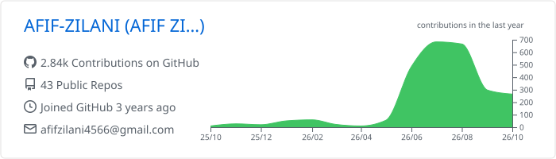
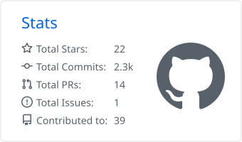
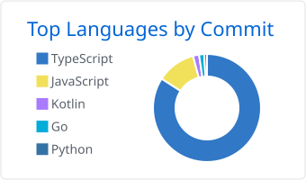

<h1 align="center">Afif Zilani</h1>

  Full-stack &amp; mobile developer · Founder of ZeroD · Naogaon, Bangladesh 
  I build software for problems I deal with first-hand — starting with a working poultry farm.

  
  
  
  
  

---

### About

- Building **ZeroD** — a small group of ventures: **ZeroD Agency** (web & mobile development), **ZeroD Farms** (Sonali poultry, ~9,000-bird flock), and **ZeroD Foundation** (health tech for rural Bangladesh).
- Most of my code serves the farm: weighing, sales records, farm management, and ESP32-based automation.
- Default stack: **Bun + Hono + Prisma + Zod + PostgreSQL** on the backend, **Next.js / React Native (Expo)** on the front — packaged as [`create-bhaze`](https://github.com/AFIF-ZILANI/create-bhaze).
- Open to freelance work and collaborations → [afifzilani.com](https://afifzilani.com)

---

### Featured work

| Project | What it is | Stack |
|---|---|---|
| [**fms-poultry-scale**](https://github.com/AFIF-ZILANI/fms-poultry-scale) | Offline-first weighing and sale-recording app for poultry farmers and wholesalers. Used on our own farm. | Expo · React Native · TypeScript · SQLite · Drizzle |
| [**fms-dashboard**](https://github.com/AFIF-ZILANI/fms-dashboard) | Farm Management System dashboard for ZeroD Farms. | TypeScript · Next.js |
| [**create-bhaze**](https://github.com/AFIF-ZILANI/create-bhaze) | CLI that scaffolds a production-ready Hono + Prisma + Zod API — RFC 7807 errors, Zod-validated env, zero `process.env` leaks. | TypeScript · Bun · Hono |
| [**Zverts**](https://github.com/zerodagencies/zverts) | Turns YouTube playlists into structured courses with XP, streaks, and certificates. *In development.* | React · Vite · Supabase |

---

### Stack

---

### GitHub activity

<!-- Cards are generated daily by .github/workflows/summary-cards.yml and committed to this repo — no third-party server can take them down. -->

  <picture>
    <source media="(prefers-color-scheme: dark)" srcset="./profile-summary-card-output/github_dark/0-profile-details.svg">
    
  </picture>

  <picture>
    <source media="(prefers-color-scheme: dark)" srcset="./profile-summary-card-output/github_dark/3-stats.svg">
    
  </picture>
  <picture>
    <source media="(prefers-color-scheme: dark)" srcset="./profile-summary-card-output/github_dark/2-most-commit-language.svg">
    
  </picture>

  <picture>
    <source media="(prefers-color-scheme: dark)" srcset="https://streak-stats.demolab.com/?user=AFIF-ZILANI&theme=github-dark-blue&hide_border=true">
    
  </picture>

<!-- Generated daily by .github/workflows/snake.yml into the `output` branch. -->

  <picture>
    <source media="(prefers-color-scheme: dark)" srcset="https://raw.githubusercontent.com/AFIF-ZILANI/AFIF-ZILANI/output/github-snake-dark.svg">
    
  </picture>

